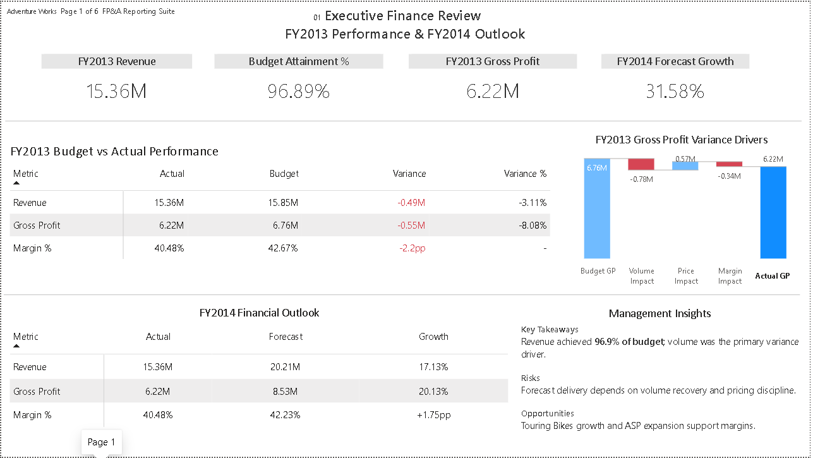
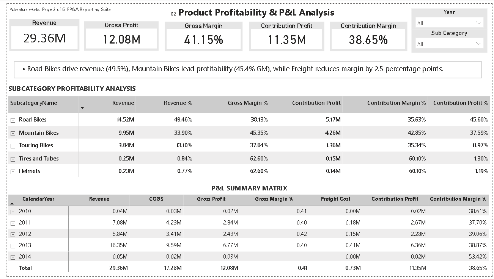
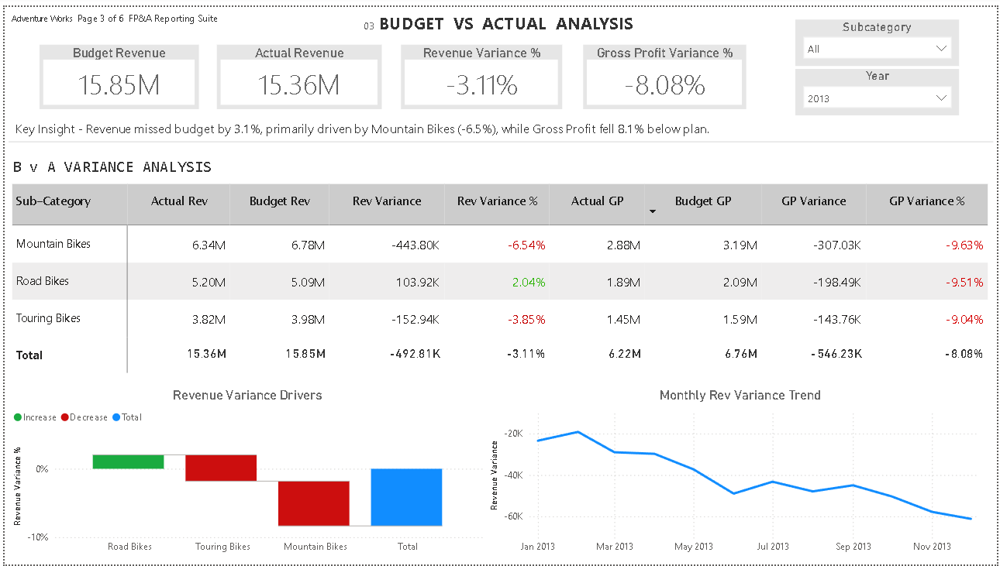
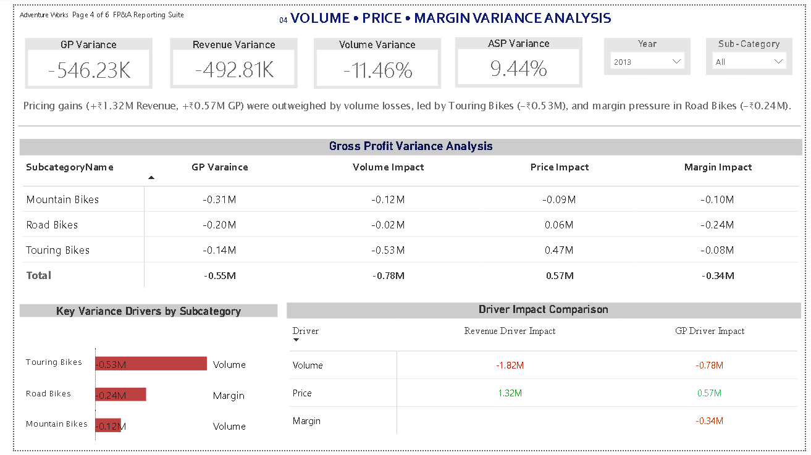
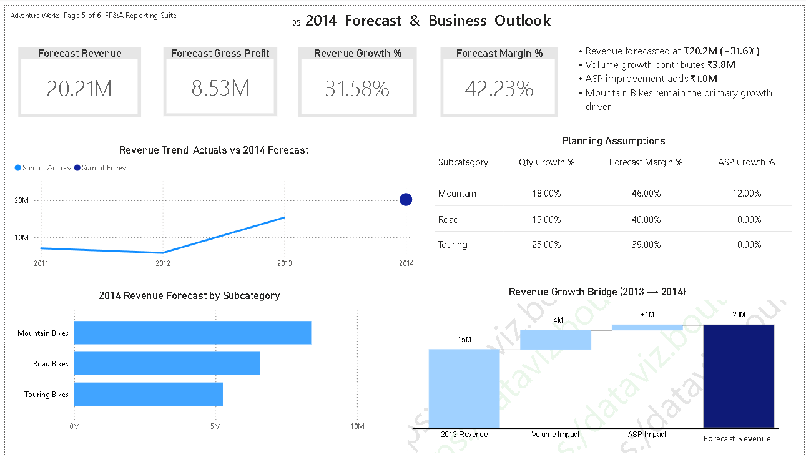
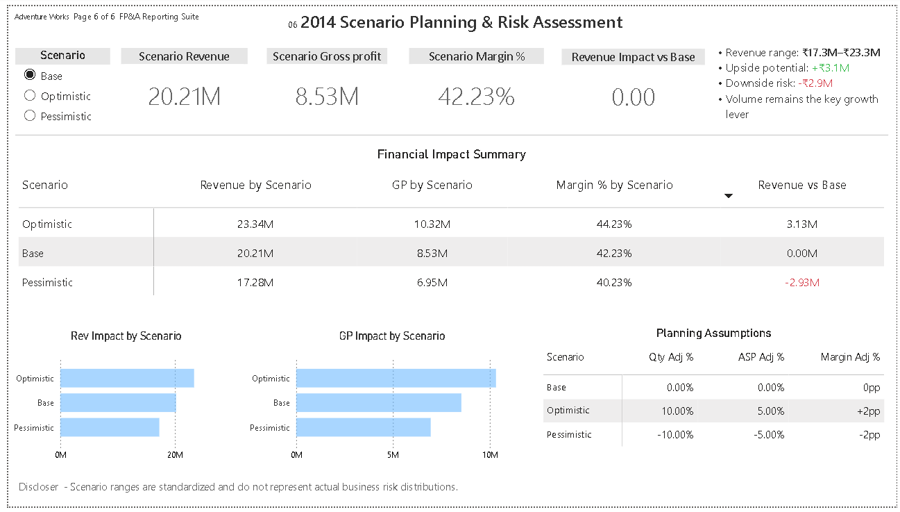

# FP&A Reporting & Financial Planning Analytics Suite

Built an end-to-end FP&A reporting solution using SQL, PostgreSQL, Python, Excel, and Power BI covering P&L reporting, Budget vs Actual analysis, variance analysis, forecasting, and scenario planning.

## Dashboard Pages

### 1. Executive Finance Review

Provides a high-level summary of revenue, profitability, budget attainment, and forecast outlook.

---

### 2. Product Profitability & P&L Analysis

Analyzes revenue, gross profit, contribution profit, and profitability drivers across product categories.

---

### 3. Budget vs Actual Analysis

Evaluates actual performance against budget and identifies key revenue and profit variances.

---

### 4. Volume • Price • Margin Variance Analysis

Breaks variance into volume, price, and margin drivers to identify root causes of performance changes.

---

### 5. Forecast & Business Outlook

Projects future revenue and profitability based on planning assumptions and forecast models.

---

### 6. Scenario Planning & Risk Assessment

Compares optimistic, base, and pessimistic scenarios to support financial planning and decision-making.

---

## Skills Demonstrated

FP&A • Financial Analysis • P&L Reporting • Budgeting & Forecasting • Budget vs Actual Analysis • Variance Analysis • Revenue Forecasting • Scenario Planning • Profitability Analysis • SQL • PostgreSQL • Power BI • Python • Advanced Excel • Data Modeling • Star Schema Design • ETL Development
